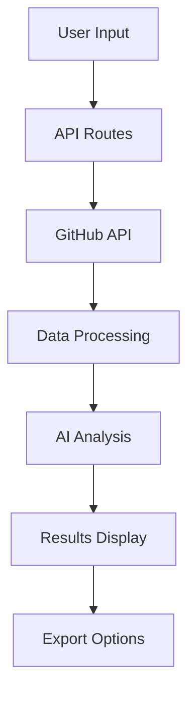

<div align="center">
  
  
  # RepoGist
  
  ### Understand Any Codebase in Seconds
  
  AI-powered GitHub repository analyzer that gives you instant insights on code quality, architecture, security, and actionable improvements.

  <br />

[](https://repo-gist.vercel.app)
[](https://github.com/Devsethi3/Repo-Gist)
[](LICENSE)

  <br />
  
  <p>
    <a href="#-features">Features</a> •
    <a href="#-quick-start">Quick Start</a> •
    <a href="#-api-reference">API</a> •
    <a href="#-contributing">Contributing</a> •
    <a href="#-license">License</a>
  </p>

  <br />

  

</div>

<br />

---

## 📖 About

**RepoGist** is an open-source tool that leverages AI to analyze GitHub repositories instantly. Whether you're evaluating a new library, onboarding to a codebase, or auditing your own project, RepoGist provides comprehensive insights in seconds.

### Why RepoGist?

- ⏱️ **Save Hours** - Understand any codebase in seconds, not hours
- 🧠 **AI-Powered** - Intelligent analysis using advanced language models
- 📊 **Comprehensive** - Code quality, security, architecture, and more
- 🎨 **Beautiful UI** - Modern, responsive interface with dark mode
- 🔒 **Privacy First** - No code is stored; analysis happens in real-time
- 🆓 **Free & Open Source** - MIT licensed, community-driven

---

## ✨ Features

### Core Analysis

| Feature                      | Description                                                |
| ---------------------------- | ---------------------------------------------------------- |
| 📊 **Health Scoring**        | Get a comprehensive score (0-100) for overall code quality |
| 🏗️ **Architecture Analysis** | Visualize component relationships and data flow            |
| 🛡️ **Security Insights**     | Identify potential vulnerabilities and security issues     |
| 📦 **Dependency Analysis**   | Understand package dependencies and outdated packages      |
| 🏷️ **Tech Stack Detection**  | Automatically identify frameworks and technologies         |
| 💡 **AI Recommendations**    | Get actionable improvement suggestions                     |
| 🌿 **Branch Analysis**       | Analyze any branch, not just the default branch            |
| 🔀 **Data Flow Diagram**     | Interactive Mermaid diagrams showing data flow patterns    |

### Export & Sharing

| Feature                     | Description                                             |
| --------------------------- | ------------------------------------------------------- |
| 📋 **Copy Plain Text**      | Copy the analysis report as formatted plain text        |
| 📝 **Copy Markdown**        | Copy the full report in Markdown format for docs/issues |
| 📥 **Download PDF Report**  | Export a detailed PDF report with all insights (jsPDF)  |
| 📤 **Social Sharing**       | Share analysis on Twitter, LinkedIn, or copy link       |
| 🖼️ **Download Share Cards** | Export beautiful share cards as images                  |

### User Experience

| Feature                      | Description                                        |
| ---------------------------- | -------------------------------------------------- |
| 📁 **Interactive File Tree** | Explore repository structure with file statistics  |
| 🔄 **Real-time Progress**    | Watch the analysis happen live with status updates |
| 🌙 **Dark/Light Mode**       | Beautiful themes for any preference                |
| 📱 **Fully Responsive**      | Works seamlessly on desktop, tablet, and mobile    |
| ⚡ **Lightning Fast**        | Built with Next.js 16 for optimal performance      |
| 💾 **Smart Caching**         | Recently analyzed repos load instantly             |

---

## 🚀 Quick Start

### Prerequisites

Before you begin, ensure you have the following installed:

- **Node.js** 18.0 or higher
- **pnpm** (recommended) or npm/yarn
- **Git**

```bash
# Check Node.js version
node --version  # Should be >= 18.0.0

# Install pnpm if not installed
npm install -g pnpm
```

### Installation

1. **Clone the repository**

```bash
git clone https://github.com/Devsethi3/Repo-Gist.git
cd Repo-Gist
```

2. **Install dependencies**

```bash
pnpm install
```

3. **Set up environment variables**

```bash
cp .env.example .env.local
```

4. **Configure your API keys** (see [Environment Variables](#environment-variables))

5. **Start development server**

```bash
pnpm dev
```

6. **Open your browser**

Navigate to [http://localhost:3000](http://localhost:3000)

### Environment Variables

Create a `.env.local` file in the root directory with the following variables:

```env
# ===========================================
# REQUIRED VARIABLES
# ===========================================

# GitHub Personal Access Token
# Used to fetch repository data from GitHub API
# Get yours at: https://github.com/settings/tokens
# Required scopes: repo, read:user
GITHUB_TOKEN=ghp_xxxxxxxxxxxxxxxxxxxx

# OpenRouter API Key
# Used for AI-powered analysis
# Get yours at: https://openrouter.ai/keys
OPENROUTER_API_KEY=sk-or-xxxxxxxxxxxxxxxxxxxx

# ===========================================
# OPTIONAL VARIABLES
# ===========================================

# Site URL (used for SEO and social sharing)
NEXT_PUBLIC_SITE_URL=http://localhost:3000

# Cache duration in seconds (default: 3600)
CACHE_TTL=3600
```

<details>
<summary><b>📋 How to get API keys (Step-by-step)</b></summary>

#### GitHub Personal Access Token

1. Log in to your GitHub account
2. Go to **Settings** → **Developer settings** → **Personal access tokens** → **Tokens (classic)**
3. Click **"Generate new token (classic)"**
4. Give it a descriptive name (e.g., "RepoGist Local Dev")
5. Select the following scopes:
   - ✅ `repo` (Full control of private repositories)
   - ✅ `read:user` (Read user profile data)
6. Click **"Generate token"**
7. **Copy the token immediately** (you won't see it again!)
8. Paste it as `GITHUB_TOKEN` in your `.env.local`

#### OpenRouter API Key

1. Go to [OpenRouter](https://openrouter.ai/)
2. Sign up or log in with your account
3. Navigate to **Settings** → **API Keys**
4. Click **"Create new key"**
5. Give it a name (e.g., "RepoGist")
6. Copy the generated key
7. Paste it as `OPENROUTER_API_KEY` in your `.env.local`

> **Note:** OpenRouter provides free credits for new users. Check their [pricing page](https://openrouter.ai/pricing) for details.

</details>

---

## 🛠️ Tech Stack

<table>
  <tr>
    <td><b>Framework</b></td>
    <td>
      
      
    </td>
  </tr>
  <tr>
    <td><b>Language</b></td>
    <td>
      
    </td>
  </tr>
  <tr>
    <td><b>Styling</b></td>
    <td>
      
      
    </td>
  </tr>
  <tr>
    <td><b>Animation</b></td>
    <td>
      
    </td>
  </tr>
  <tr>
    <td><b>Diagrams</b></td>
    <td>
      
    </td>
  </tr>
  <tr>
    <td><b>PDF Export</b></td>
    <td>
      
    </td>
  </tr>
  <tr>
    <td><b>AI</b></td>
    <td>
      
    </td>
  </tr>
  <tr>
    <td><b>Deployment</b></td>
    <td>
      
    </td>
  </tr>
</table>

### Key Dependencies

```json
{
  "next": "^16.1.0",
  "react": "^19.0.0",
  "typescript": "^5.0.0",
  "tailwindcss": "^4.0.0",
  "framer-motion": "^11.0.0",
  "@radix-ui/react-*": "latest",
  "mermaid": "^11.0.0",
  "jspdf": "^2.5.0",
  "jspdf-autotable": "^3.8.0",
  "html-to-image": "^1.11.0"
}
```

---

## 📁 Project Structure

```
repo-gist/
├── app/                          # Next.js App Router
│   ├── api/                      # API Routes
│   │   └── analyze/              # Main analysis endpoint
│   │       └── route.ts          # POST /api/analyze
│   ├── share/                    # Share pages
│   │   └── [...repo]/            # Dynamic share routes
│   │       ├── page.tsx          # Server component
│   │       └── share-page-client.tsx
│   ├── layout.tsx                # Root layout
│   ├── page.tsx                  # Home page
│   └── globals.css               # Global styles
│
├── components/                   # React Components
│   ├── ui/                       # shadcn/ui components
│   │   ├── button.tsx
│   │   ├── card.tsx
│   │   ├── dialog.tsx
│   │   └── ...
│   ├── repo-analyzer/            # Main analyzer
│   │   ├── index.tsx
│   │   ├── animations.ts
│   │   ├── branch-selector.tsx   # Branch selection dropdown
│   │   └── section-header.tsx
│   ├── share-card/               # Share card variants
│   │   ├── index.tsx
│   │   ├── variants/
│   │   └── types.ts
│   ├── share-modal/              # Share modal
│   │   ├── index.tsx
│   │   ├── desktop-dialog.tsx
│   │   └── mobile-drawer.tsx
│   ├── export/                   # Export functionality
│   │   ├── copy-plain-text.tsx   # Plain text export
│   │   ├── copy-markdown.tsx     # Markdown export
│   │   └── download-pdf.tsx      # PDF export (jsPDF)
│   ├── file-tree/                # File explorer
│   ├── score-card/               # Score display
│   ├── ai-insights/              # AI recommendations
│   ├── architecture-diagram/     # Architecture viz
│   └── data-flow-diagram/        # Data flow viz (Mermaid)
│       ├── index.tsx
│       ├── mermaid-renderer.tsx  # Mermaid diagram component
│       └── types.ts
│
├── lib/                          # Utilities & Core Logic
│   ├── ai.ts                     # AI integration
│   ├── github.ts                 # GitHub API client
│   ├── share.ts                  # Share utilities
│   ├── export/                   # Export utilities
│   │   ├── plain-text.ts         # Plain text formatter
│   │   ├── markdown.ts           # Markdown formatter
│   │   └── pdf.ts                # PDF generator (jsPDF)
│   ├── types.ts                  # TypeScript types
│   ├── utils.ts                  # Helper functions
│   └── constants.ts              # App constants
│
├── hooks/                        # Custom React Hooks
│   ├── use-analysis.ts           # Analysis state management
│   ├── use-branches.ts           # Branch fetching hook
│   ├── use-media-query.ts        # Responsive hooks
│   └── use-local-storage.ts      # Persistent storage
│
├── context/                      # React Context
│   └── analysis-context.tsx      # Analysis state provider
│
├── public/                       # Static Assets
│   ├── icon.svg                  # App icon
│   ├── og-image.png              # Open Graph image
│   └── fonts/                    # Custom fonts
│
├── .env.example                  # Environment template
├── next.config.ts                # Next.js config
├── tailwind.config.ts            # Tailwind config
├── tsconfig.json                 # TypeScript config
└── package.json                  # Dependencies
```

---

## 📖 Usage

### Basic Usage

1. **Enter a GitHub URL**

   Paste any public GitHub repository URL into the input field:

   ```
   https://github.com/vercel/next.js
   ```

2. **Select a Branch (Optional)**

   Use the branch selector dropdown to choose which branch to analyze:

   - `main` (default)
   - `develop`
   - `feature/new-feature`
   - Any available branch

3. **Start Analysis**

   Click the **"Analyze"** button or press `Enter`

4. **View Results**

   Explore the comprehensive analysis including:

   - Overall health score
   - File structure visualization
   - AI-powered insights
   - Architecture diagrams
   - Data flow diagrams (Mermaid)
   - Improvement suggestions

### Branch Analysis

RepoGist now supports analyzing any branch in a repository:

```
https://github.com/vercel/next.js
Branch: canary
```

1. Enter the repository URL
2. Click the **branch dropdown** next to the input
3. Select the desired branch from the list
4. Click **Analyze** to analyze that specific branch

### Export Options

After analyzing a repository, you have multiple export options:

| Option                 | Description                                  | Format |
| ---------------------- | -------------------------------------------- | ------ |
| 📋 **Copy Plain Text** | Copy a formatted text summary to clipboard   | `.txt` |
| 📝 **Copy Markdown**   | Copy full report in Markdown for docs/README | `.md`  |
| 📥 **Download PDF**    | Download a detailed PDF report with all data | `.pdf` |
| 🖼️ **Download Image**  | Save the share card as an image              | `.png` |
| 🔗 **Copy Share Link** | Copy a shareable URL to the analysis         | URL    |

#### Copy Plain Text

```
Repository: vercel/next.js
Branch: main
Health Score: 92/100

Scores:
- Code Quality: 95/100
- Documentation: 90/100
- Security: 88/100
- Maintainability: 94/100

Tech Stack: TypeScript, React, Next.js, Turbopack

Key Insights:
✓ Excellent documentation with comprehensive API docs
⚠ 5 dependencies have newer versions available
...
```

#### Copy Markdown

```markdown
# Repository Analysis: vercel/next.js

**Branch:** `main`  
**Health Score:** 92/100 ⭐

## Scores

| Category        | Score |
| --------------- | ----- |
| Code Quality    | 95    |
| Documentation   | 90    |
| Security        | 88    |
| Maintainability | 94    |

## Tech Stack

- TypeScript
- React
- Next.js
- Turbopack

## Key Insights

### Strengths

- ✅ Excellent documentation with comprehensive API docs

### Suggestions

- ⚠️ 5 dependencies have newer versions available
  ...
```

#### Download PDF

The PDF report includes:

- Cover page with repository info and score
- Detailed score breakdown with visualizations
- Complete tech stack analysis
- AI-powered insights and recommendations
- Architecture overview
- Data flow diagrams
- File statistics
- Actionable improvement suggestions

### Data Flow Diagram

RepoGist generates interactive Mermaid diagrams showing how data flows through your application:



The data flow diagram shows:

- Component interactions
- Data transformation steps
- External service connections
- State management flow

### Example Repositories

Try analyzing these popular repositories:

| Repository                                    | Description              |
| --------------------------------------------- | ------------------------ |
| `https://github.com/facebook/react`           | React JavaScript library |
| `https://github.com/vercel/next.js`           | Next.js framework        |
| `https://github.com/tailwindlabs/tailwindcss` | Tailwind CSS             |
| `https://github.com/shadcn-ui/ui`             | shadcn/ui components     |
| `https://github.com/microsoft/vscode`         | VS Code editor           |

### Sharing Your Analysis

After analyzing a repository, click the **Share** button to:

| Option           | Description                     |
| ---------------- | ------------------------------- |
| 📋 **Copy Link** | Copy shareable URL to clipboard |
| 🐦 **Twitter/X** | Share with pre-filled tweet     |
| 💼 **LinkedIn**  | Share on LinkedIn with details  |
| 📥 **Download**  | Save as PNG image               |

---

## 🔌 API Reference

### Analyze Repository

Analyzes a GitHub repository and returns comprehensive insights.

```http
POST /api/analyze
```

#### Request

**Headers:**

```
Content-Type: application/json
```

**Body:**

```json
{
  "repoUrl": "https://github.com/owner/repo",
  "branch": "main",
  "forceRefresh": false
}
```

| Parameter      | Type    | Required | Description                                 |
| -------------- | ------- | -------- | ------------------------------------------- |
| `repoUrl`      | string  | Yes      | Full GitHub repository URL                  |
| `branch`       | string  | No       | Branch to analyze (default: default branch) |
| `forceRefresh` | boolean | No       | Skip cache and re-analyze (default: false)  |

#### Response

**Success (200):**

```json
{
  "success": true,
  "cached": false,
  "data": {
    "metadata": {
      "name": "next.js",
      "fullName": "vercel/next.js",
      "description": "The React Framework",
      "stars": 120000,
      "forks": 25000,
      "language": "TypeScript",
      "branch": "main",
      "owner": {
        "login": "vercel",
        "avatarUrl": "https://avatars.githubusercontent.com/u/..."
      }
    },
    "scores": {
      "overall": 92,
      "codeQuality": 95,
      "documentation": 90,
      "security": 88,
      "maintainability": 94,
      "testCoverage": 85,
      "dependencies": 90
    },
    "insights": [
      {
        "type": "strength",
        "title": "Excellent Documentation",
        "description": "Comprehensive README and API docs",
        "priority": "high"
      },
      {
        "type": "suggestion",
        "title": "Update Dependencies",
        "description": "5 packages have newer versions",
        "priority": "medium"
      }
    ],
    "techStack": ["TypeScript", "React", "Next.js", "Turbopack"],
    "fileTree": { ... },
    "fileStats": {
      "totalFiles": 1250,
      "totalLines": 450000,
      "languages": { "TypeScript": 85, "JavaScript": 10, "CSS": 5 }
    },
    "architecture": [ ... ],
    "dataFlow": {
      "nodes": [
        { "id": "1", "label": "User Input", "type": "input" },
        { "id": "2", "label": "API Routes", "type": "process" },
        { "id": "3", "label": "GitHub API", "type": "external" }
      ],
      "edges": [
        { "from": "1", "to": "2", "label": "request" },
        { "from": "2", "to": "3", "label": "fetch" }
      ],
      "mermaid": "flowchart TD\n    A[User Input] --> B[API Routes]\n    B --> C[GitHub API]"
    },
    "refactors": [ ... ],
    "automations": [ ... ],
    "summary": "Next.js is a well-maintained React framework..."
  }
}
```

**Error (400):**

```json
{
  "success": false,
  "error": "Invalid GitHub URL",
  "code": "INVALID_URL"
}
```

**Error (404):**

```json
{
  "success": false,
  "error": "Repository not found",
  "code": "REPO_NOT_FOUND"
}
```

**Error (422):**

```json
{
  "success": false,
  "error": "Branch not found",
  "code": "BRANCH_NOT_FOUND"
}
```

**Error (429):**

```json
{
  "success": false,
  "error": "Rate limit exceeded",
  "code": "RATE_LIMITED",
  "retryAfter": 60
}
```

### Get Branches

Fetches all available branches for a repository.

```http
GET /api/branches?repo=owner/repo
```

#### Response

**Success (200):**

```json
{
  "success": true,
  "data": {
    "branches": [
      { "name": "main", "protected": true, "default": true },
      { "name": "develop", "protected": false, "default": false },
      { "name": "feature/new-ui", "protected": false, "default": false }
    ],
    "defaultBranch": "main"
  }
}
```

#### Example Usage

**cURL:**

```bash
curl -X POST https://repo-gist.vercel.app/api/analyze \
  -H "Content-Type: application/json" \
  -d '{"repoUrl": "https://github.com/vercel/next.js", "branch": "canary"}'
```

**JavaScript/TypeScript:**

```typescript
const response = await fetch("/api/analyze", {
  method: "POST",
  headers: { "Content-Type": "application/json" },
  body: JSON.stringify({
    repoUrl: "https://github.com/vercel/next.js",
    branch: "canary",
  }),
});

const data = await response.json();
console.log(data.data.scores.overall); // 92
console.log(data.data.dataFlow.mermaid); // Mermaid diagram code
```

---

## 🧪 Development

### Available Scripts

| Command           | Description              |
| ----------------- | ------------------------ |
| `pnpm dev`        | Start development server |
| `pnpm build`      | Build for production     |
| `pnpm start`      | Start production server  |
| `pnpm lint`       | Run ESLint               |
| `pnpm lint:fix`   | Fix ESLint errors        |
| `pnpm type-check` | Run TypeScript check     |
| `pnpm format`     | Format with Prettier     |

### Code Style

This project uses:

- **ESLint** for code linting
- **Prettier** for code formatting
- **TypeScript** for type safety

```bash
# Run all checks
pnpm lint && pnpm type-check

# Auto-fix issues
pnpm lint:fix && pnpm format
```

### Testing Locally

1. **Test the API:**

```bash
curl -X POST http://localhost:3000/api/analyze \
  -H "Content-Type: application/json" \
  -d '{"repoUrl": "https://github.com/facebook/react", "branch": "main"}'
```

2. **Test Branch Fetching:**

```bash
curl "http://localhost:3000/api/branches?repo=facebook/react"
```

3. **Test Share Page:**

```
http://localhost:3000/share/facebook/react
```

---

## 🤝 Contributing

We welcome contributions from the community! Here's how you can help:

### Ways to Contribute

- 🐛 **Report Bugs** - Found a bug? [Open an issue](https://github.com/Devsethi3/Repo-Gist/issues)
- 💡 **Suggest Features** - Have an idea? [Start a discussion](https://github.com/Devsethi3/Repo-Gist/discussions)
- 📝 **Improve Docs** - Help us improve documentation
- 🔧 **Submit PRs** - Fix bugs or add features

### Getting Started

1. **Fork the repository**

```bash
# Click the "Fork" button on GitHub, then:
git clone https://github.com/YOUR_USERNAME/Repo-Gist.git
cd Repo-Gist
```

2. **Create a branch**

```bash
git checkout -b feature/amazing-feature
# or
git checkout -b fix/bug-description
```

3. **Make your changes**

```bash
# Install dependencies
pnpm install

# Start dev server
pnpm dev

# Make your changes...
```

4. **Commit your changes**

```bash
git add .
git commit -m "feat: add amazing feature"
```

5. **Push and create PR**

```bash
git push origin feature/amazing-feature
# Then open a Pull Request on GitHub
```

### Commit Convention

We follow [Conventional Commits](https://www.conventionalcommits.org/):

| Type       | Description      | Example                          |
| ---------- | ---------------- | -------------------------------- |
| `feat`     | New feature      | `feat: add dark mode toggle`     |
| `fix`      | Bug fix          | `fix: resolve memory leak`       |
| `docs`     | Documentation    | `docs: update API reference`     |
| `style`    | Formatting       | `style: fix indentation`         |
| `refactor` | Code refactoring | `refactor: simplify auth logic`  |
| `perf`     | Performance      | `perf: optimize image loading`   |
| `test`     | Tests            | `test: add unit tests for utils` |
| `chore`    | Maintenance      | `chore: update dependencies`     |

### Pull Request Guidelines

- ✅ Follow the existing code style
- ✅ Write meaningful commit messages
- ✅ Update documentation if needed
- ✅ Test your changes thoroughly
- ✅ Keep PRs focused and small

---

## 📝 License

This project is licensed under the **MIT License**.

```
MIT License

Copyright (c) 2024 Dev Prasad Sethi

Permission is hereby granted, free of charge, to any person obtaining a copy
of this software and associated documentation files (the "Software"), to deal
in the Software without restriction, including without limitation the rights
to use, copy, modify, merge, publish, distribute, sublicense, and/or sell
copies of the Software, and to permit persons to whom the Software is
furnished to do so, subject to the following conditions:

The above copyright notice and this permission notice shall be included in all
copies or substantial portions of the Software.

THE SOFTWARE IS PROVIDED "AS IS", WITHOUT WARRANTY OF ANY KIND, EXPRESS OR
IMPLIED, INCLUDING BUT NOT LIMITED TO THE WARRANTIES OF MERCHANTABILITY,
FITNESS FOR A PARTICULAR PURPOSE AND NONINFRINGEMENT. IN NO EVENT SHALL THE
AUTHORS OR COPYRIGHT HOLDERS BE LIABLE FOR ANY CLAIM, DAMAGES OR OTHER
LIABILITY, WHETHER IN AN ACTION OF CONTRACT, TORT OR OTHERWISE, ARISING FROM,
OUT OF OR IN CONNECTION WITH THE SOFTWARE OR THE USE OR OTHER DEALINGS IN THE
SOFTWARE.
```

See the [LICENSE](LICENSE) file for details.

---

## 🗺️ Roadmap

### Upcoming Features

- [ ] 🔐 **Private Repository Support** - Analyze private repos with OAuth
- [ ] 📊 **Historical Tracking** - Track score changes over time
- [ ] 🔔 **Webhook Notifications** - Get alerts on score changes
- [ ] 📈 **Team Dashboard** - Analyze multiple repos at once
- [ ] 🤖 **GitHub Action** - Integrate into CI/CD pipeline
- [ ] 📱 **Mobile App** - Native iOS and Android apps
- [ ] 🔍 **Compare Branches** - Side-by-side branch comparison
- [ ] 📧 **Email Reports** - Schedule automated email reports

### Recently Completed

- [x] ✅ Branch analysis support
- [x] ✅ Data flow diagrams (Mermaid)
- [x] ✅ Copy as plain text
- [x] ✅ Copy as Markdown
- [x] ✅ Download PDF report (jsPDF)
- [x] ✅ Social sharing (Twitter, LinkedIn)
- [x] ✅ Download as image
- [x] ✅ Dark/Light mode
- [x] ✅ Real-time analysis progress
- [x] ✅ Smart caching

---

## ❓ FAQ

<details>
<summary><b>Is RepoGist free to use?</b></summary>

Yes! RepoGist is completely free and open source. You can use the hosted version at [repo-gist.vercel.app](https://repo-gist.vercel.app) or self-host it.

</details>

<details>
<summary><b>Is my code stored anywhere?</b></summary>

No. RepoGist analyzes repositories in real-time and does not store any code. Only the analysis results are temporarily cached for performance.

</details>

<details>
<summary><b>Can I analyze private repositories?</b></summary>

Currently, only public repositories are supported. Private repository support is on our roadmap.

</details>

<details>
<summary><b>Can I analyze different branches?</b></summary>

Yes! Use the branch selector dropdown to choose any available branch in the repository before analyzing.

</details>

<details>
<summary><b>What export formats are supported?</b></summary>

RepoGist supports multiple export formats:

- **Plain Text** - Simple formatted text for quick sharing
- **Markdown** - Full report in Markdown format for documentation
- **PDF** - Detailed PDF report with all insights and diagrams
- **Image** - Share card as PNG image

</details>

<details>
<summary><b>How accurate is the analysis?</b></summary>

RepoGist uses advanced AI models to analyze code patterns, but results should be considered as suggestions rather than absolute truths. Always use your own judgment.

</details>

<details>
<summary><b>What languages are supported?</b></summary>

RepoGist can analyze repositories in any programming language. The AI model understands most popular languages including JavaScript, TypeScript, Python, Go, Rust, Java, and more.

</details>

<details>
<summary><b>What is the data flow diagram?</b></summary>

The data flow diagram is an interactive Mermaid visualization that shows how data moves through your application, including component interactions, external service calls, and state management patterns.

</details>

---

## 🙏 Acknowledgments

Special thanks to these amazing projects:

- [Next.js](https://nextjs.org/) - The React framework for the web
- [shadcn/ui](https://ui.shadcn.com/) - Beautiful, accessible components
- [Tailwind CSS](https://tailwindcss.com/) - Utility-first CSS framework
- [Framer Motion](https://www.framer.com/motion/) - Animation library
- [Mermaid](https://mermaid.js.org/) - Diagramming and charting library
- [jsPDF](https://github.com/parallax/jsPDF) - PDF generation library
- [OpenRouter](https://openrouter.ai/) - AI model gateway
- [Vercel](https://vercel.com/) - Deployment platform
- [Lucide](https://lucide.dev/) - Beautiful icons
- [Radix UI](https://www.radix-ui.com/) - Accessible primitives

---

## 📬 Contact & Support

- 🐛 **Bug Reports:** [GitHub Issues](https://github.com/Devsethi3/Repo-Gist/issues)
- 💬 **Discussions:** [GitHub Discussions](https://github.com/Devsethi3/Repo-Gist/discussions)
- 🐦 **Twitter:** [@imsethidev](https://x.com/imsethidev)

---

<div align="center">

## 👤 Author


### Dev Prasad Sethi

Full Stack Developer • Open Source Enthusiast

[](https://x.com/imsethidev)
[](https://github.com/Devsethi3)
[](https://devsethi.vercel.app)

---

### Show Your Support

If you find this project useful, please consider:

<a href="https://github.com/Devsethi3/Repo-Gist">
  
</a>

<br /><br />

**Share with others:**

[](https://twitter.com/intent/tweet?text=Check%20out%20RepoGist%20-%20AI-powered%20GitHub%20repo%20analyzer!&url=https://repo-gist.vercel.app)
[](https://www.linkedin.com/sharing/share-offsite/?url=https://repo-gist.vercel.app)

<br /><br />

---

Made with ❤️ and ☕ by [Dev Prasad Sethi](https://github.com/Devsethi3)

<sub>© 2024 RepoGist. All rights reserved.</sub>

</div>
